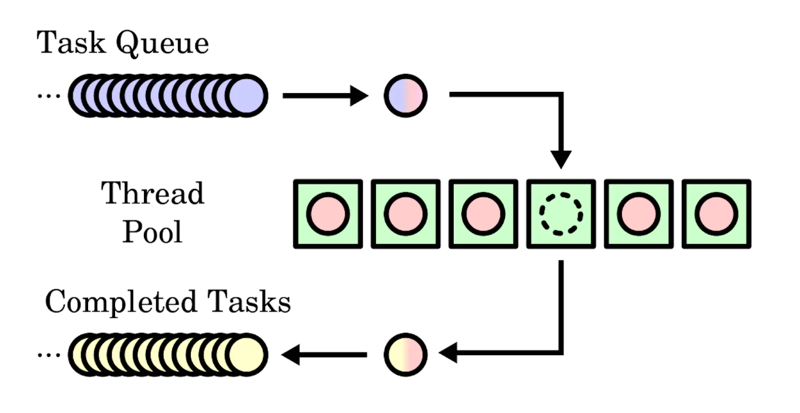

## Реализация пула потоков на языке C++

Для начала оговорюсь, что это мой небольшой учебный проект, целью которого является поглубже познакомиться с многопоточностью в с++.



Немного поэксперементировав с наивными реализациями я взялся написать более совершенную и удобную реализацию Thread Pool'а, и поставил перед собой цель создать удобный интерфейс взаимодействия пользователя с пулом потоков, разработав при этом достойный формат отдаваемых пулу заданий.

Любую задачу, поступающую на обработку Thread Pool'ом я предлагаю объявлять наследником абстрактного класса `Task`:

```c++
Task {
    // для доступа к TaskStatus из ThreadPool
    friend class ThreadPool;
 public:

    enum class TaskStatus {
        awating,
        completed
    };
    
    // для красивого логирования
    Task(const std::string description_);

    // абстрактный метод, который должен быть реализован пользователем,
    // в теле этой функции должен находиться тракт решения текущей задачи
    void virtual one_thread_method() = 0;   

    // абстрактный метод, который должен быть реализован пользователем,
    // где реализованв вывод в консоль
    void virtual show_result() = 0;
    
    virtual ~Task() = default;

 protected:
    std::string description;

    MT::Task::TaskStatus status;

    size_t task_id;

    // для возможности добавления новых задач в пул прямо из задачи
    ThreadPool* thread_pool;

    // метод, запускаемый потоком
    void one_thread_pre_method();
}
```

Данный подход имеет как преимущества, так и недостатки.

Плюсы:

* Объект задачи уже внутри себя содержит все необходимые ресурсы для ее решения, а потокам пула достаточно лишь вызвать метод `Task::one_thread_pre_method()`, не принимающий никаких лишних аргументов и не возвращающий значений.

* В силу наличия свойства абстрактности у `Task`, запрещено создавать "бесполезные" объекты данного класса.

* Многие реализации в качестве задачи используют шаблонные функции с произвольным числом аргументов вида `template <typename FuncRetType, typename ...Args, typename ...FuncTypes> Task(FuncRetType(*func)(FuncTypes...), Args&&... args)`, что влечет за собой "протягивание" кучи параметров и подвергает проект более тяжелой отладке. В моем случае простейшие, но незаметные ошибки при создании задач будут обнаружены в момент вызова конструктора класса задачи на этапе написания кода, а не на этапе компиляции.

Минусы:

* Под каждый отдельный вид задачи нужно объявлять целый класс. Это может оказаться более громоздким, чем написание новой функции.

* От пользователя требуется владение навыками объектно-ориентированного программирования. Никто не отменял различные проблемы, связанные с наследованием и множественным наследованием.


Прежде переходить к реализации самого пула потоков напишем небольшую обёртку над потоком:

```c++
struct Thread {
        std::thread _thread;
        std::atomic<bool> is_working;

        Thread() : _thread(), is_working(false) {}

        Thread(const std::thread& other) = delete;
        Thread operator=(const Thread& other) = delete;

        Thread(Thread&& other) noexcept : _thread(std::move(other._thread)), 
                                          is_working(other.is_working.load()) {}
    
        Thread& operator=(Thread&& other) noexcept {
            if (this != &other) {
                _thread = std::move(other._thread);
                is_working.store(other.is_working.load());
            }
            return *this;
        }
    };
```

Итак, можно переходить непосредственно к релизации пула потоков - класса `ThreadPool`:

```c++
class ThreadPool {
 public:

    ThreadPool(size_t NUM_THREADS);

    // шаблонная функция добавления задачи в очередь
    template <typename TaskChild>
    size_t add_task(std::shared_ptr<TaskChild> task);

    // ожидание полной обработки текущей очереди задач, игнорируя любые
    // сигналы о приостановке
    void wait();

    // приостановка обработки
    void stop();

    // возобновление обработки
    void start();

    // получение результата по id
    template <typename TaskChild>
    std::shared_ptr<TaskChild> get_result(size_t id);

    // очистка завершенных задач
    void clear_completed();

    // установка флага логирования
    void set_logger_flag(bool flag);

    ~ThreadPool();


 protected:
    // мьютексы, блокирующие очереди для потокобезопасного обращения
    std::mutex task_queue_mutex;
    std::mutex completed_tasks_mutex;
    
    // мьютекс, блокирующий логер для последовательного вывода
    std::mutex logger_mutex;

    // мьютекс, блокирующий функции ожидающие результаты (метод wait())
    std::mutex wait_mutex;


    std::condition_variable tasks_access;
    std::condition_variable wait_access;

    // флаг остановки работы пула
    std::atomic<bool> stopped;
    // флаг приостановки работы
    std::atomic<bool> paused;
    // флаг, разрешающий логирования
    std::atomic<bool> logger_flag;

    // набор доступных потоков
    std::vector<MT::Thread> threads;

    Logger logger;

    // очередь задач
    std::queue<std::shared_ptr<Task>> task_queue;
    size_t last_task_id;

    // массив выполненных задач в виде хэш-таблицы
    std::unordered_map<size_t, std::shared_ptr<Task>> completed_tasks;
    size_t completed_task_count;

    // основная функция, инициализирующая каждый поток
    void run(MT::Thread& thread);

    // разрешение запуска очередного потока
    bool run_allowed() const;

    // Проверка решения всех задач, переданных пулу
    bool is_comleted() const;
}
```

Для хранения задач в очереди я использовал "умные" указатели `std::shared_ptr`. Это, в основном, необходимо для преобразования из дочернего класса задачи в базовый класс Task (*upcasting*) при добавлении в очередь и обратно (*downcasting*) при выгрузке результата ("игра на понижение").

Решенные задачи по окончании обработки сохраняются в хеш-таблице ThreadPool::completed_tasks. Такой вариант был выбран из соображений быстрого поиска по идентификатору.

Атрибут `ThreadPool::logger` — это объект вспомогательного класса Logger для логирования. Отношения к рассматриваемой задаче он не имеет, поэтому углубляться в его реализацию я не буду. Все, что он делает, это вычисляет временные интервалы и "красиво" выводит время начала и конца исполнения задачи, а также её описание.

Теперь перейдем к определению методов объявленных классов. С классом `Task` все предельно просто:

```c++

Task(const std::string description_) : description(description_) {
    status = MT::Task::TaskStatus::awating;
    thread_pool = nullptr;
    // Поскольку id задачи будет задачаться самим пулом, то 
    // поле task_id пока что нечем проинициализировать
}

one_thread_pre_method() {
    one_thread_method();
    status = MT::Task::TaskStatus::completed;
}
```

Стоит отметить, что `Task::task_id` свою уникальность приобретает не в момент создания объекта, а в момент добавления в очередь задач (`ThreadPool::add_task`) и никак не контролируется пользователем. Также в момент добавления в очередь с текущей задачей будет связан обрабатывающий ее пул потоков (`Task::thread_pool` по умолчанию `nullptr`). Этот атрибут необходим для обратной связи с пулом, а именно для возможности распараллелить уже исполняемую задачу. 

Теперь поговорим об основном классе `ThreadPool`.

```c++
MT::ThreadPool::ThreadPool(size_t NUM_THREADS) : logger(logger_mutex) {
	paused.store(true);
    stopped.store(false);
    logger_flag.store(true);
	completed_task_count = 0;
    last_task_id = 0;
	threads.reserve(NUM_THREADS);
	for (size_t i : std::ranges::iota_view(static_cast<size_t>(0), NUM_THREADS)) {
		threads.emplace_back();
	}
	for (size_t i : std::ranges::iota_view(static_cast<size_t>(0), NUM_THREADS)) {
		threads[i]._thread = std::move(std::thread(&ThreadPool::run, this, std::ref(threads[i])));
		threads[i].is_working.store(false);
	}
}
```

При инициализации, пул потоков находится в режиме ожидания (флаг `ThreadPool::paused` по умолчанию `true`).

Флаг `ThreadPool::stopped` должен быть неизменно в состоянии `false` вплоть до вызова деструктора. Он указывает на то, что пул потоков все еще "жив" и способен выполнять поступающие задачи.

Каждый поток запускается с вызовом закрытого метода `ThreadPool::run`, передавая указатель на самого себя для контроля состояния (управление флагом `Thread::is_working`):

```c++
void MT::ThreadPool::run(MT::Thread& _thread) {
    while (!stopped.load()) {
        std::unique_lock<std::mutex> lock(task_queue_mutex);

        // текущий поток находится в режиме ожидания в случае,
        // если нет заданий либо работа всего пула приостановлена
        tasks_access.wait(lock, [this]() -> bool { return run_allowed() || stopped.load()});

        if (run_allowed()) {
            _thread.is_working.store(true);

            //достаём задачу из очереди
            std::shared_ptr<Task> task = std::move(task_queue.front());
            task_queue.pop();
            lock.unlock();

            if (logger_flag.load()) {
                std::lock_guard<std::mutex> lg(logger_mutex);
                std::cout << timer.make_checkpoint("Run task " + elem->description) << std::endl;
            }

            // решение задачи
            task->one_thread_pre_method();

            if (logger_flag) {
                std::lock_guard<std::mutex> lg(logger_mutex);
                std::cout << timer.make_checkpoint("End task " + elem->description) << std::endl;
            }

            std::lock_guard<std::mutex> lg(completed_tasks_mutex);
            completed_tasks[task->task_id] = task;
            ++completed_task_count;
            _thread.is_working.store(false);
        }
        // пробуждение потока, который находятся в ожидании пула (метод wait*)
        wait_access.notify_one()
    }
}
```

Как видно в реализации, решенная задача кладется в `ThreadPool::completed_tasks` в неизменном виде по ключу `Task::task_id`. Мною было решено не вводить излишних усложнений в виде дополнительных классов для сохранения результатов, к тому же совершенно неясно, что будет являться результатом, потому пришлось бы использовать `std::any`. Пользователь самостоятельно определит нужные ему ресурсы в дочернем классе задачи, которые будут изменены или заполнены при помощи переопределенного метода `Task::one_thread_method()`.

```c++
void MT::ThreadPool::start() {
    if (paused.load() == true) {
        paused.store(false);
        // даем всем потокам разрешающий сигнал для доступа к очереди невыполненных задач
        tasks_access.notify_all();
    }
    return;
}


void MT::ThreadPool::pause() {
    paused.store(true);
    return;
}
```

Публичные методы `ThreadPool::start()` и `ThreadPool::stop()` нужны для приостановки и возобновления работы пула в том смысле, что устанавливают потоки в режим ожидания и наоборот (важно, что потоки не уничтожаются как объекты).

Далее я продемонстрирую нехитрую реализацию метода для добавления новых задач в очередь на обработку:

```c++
template <typename TaskChild>
size_t add_task(std::shared_ptr<TaskChild> task) {
    std::lock_guard<std::mutex> lock(task_queue_mutex);
    task_queue.push(task)

    // присваиваем уникальный id новой задаче
    // минимальное значение id равно 1
    task_queue.back()->id = ++last_task_id;
    // связываем задачу с текущим пулом
    task_queue.back()->thread_pool = this;
    tasks_access.notify_one();
    return last_task_id;
}
```

Стоит отметить, что на шаблонный тип `TaskChild` негласно накладывается требование быть дочерним классом базового класса `Task`. Также, здесь с помощью `tasks_access.notify_one()` посылается разрешающий сигнал одному из потоков (неважно какому), который "застрял" в соответствующем месте внутри функции `ThreadPool::run`.

Получить результаты можно по идентификатору задачи только в том случае, если она была решена и направлена в `ThreadPool::completed_tasks`:

```c++
    template <typename TaskChild>
    std::shared_ptr<TaskChild> get_result(size_t task_id) {
        auto it = completed_tasks.find(task_id);
        if (it != completed_tasks.end()) {
            return std::dynamic_pointer_cast<TaskChild>(it->second);
        } else {
            return nullptr;
        }
    }
```

Для корректного преобразования типов внутри `ThreadPool::get_result`, необходимо заранее знать тип задачи.

```c++
bool MT::ThreadPool::is_comleted() const {
	return completed_task_count == last_task_id;
}

void MT::ThreadPool::wait() {
	std::lock_guard<std::mutex> lock_wait(wait_mutex);

	start();

	std::unique_lock<std::mutex> lock(task_queue_mutex);
	wait_access.wait(lock, [this]()->bool { return is_comleted(); });

	stop();
}
```

Метод `ThreadPool::wait()` позволяет дождаться выполнения всех текущих задач из очереди ThreadPool::task_queue, игнорируя сигналы об остановке.

Остались еще пару вспомогательных методов и деструктор:

```c++
void MT::ThreadPool::clear_completed() {
	std::lock_guard<std::mutex> lock(completed_tasks_mutex);
	completed_tasks.clear();
}

void MT::ThreadPool::set_logger_flag(bool flag) {
	logger_flag = flag;
}

MT::ThreadPool::~ThreadPool() {
	stopped.store(true);
	tasks_access.notify_all();
	for (size_t i : std::ranges::iota_view(static_cast<size_t>(0), threads.size())) {
        if (threads[i]._thread.joinable()) {
		    threads[i]._thread.join();
        }
	}
}
```

Метод `ThreadPool::clear_completed()` может пригодиться для того, чтобы не хранить ненужные результаты на протяжении всего времени жизни пула. Как я и обещал ранее, флаг `ThreadPool::stopped` становится `true` только в момент уничтожения пула. Собственно говоря, тут и происходит `std::thread::join()` каждого из потоков.

Позднее мной был реализован метод, который должен был считать количество загруженных потоков:

```c++
size_t MT::ThreadPool::count_working_threads() {
	size_t result = 0;
	for (uint16_t i : std::ranges::iota_view(0u, threads.size())) {
		result += threads[i].is_working.load();
	}
	return result;
}
```

### Пример использования ThreadPool

Я написал небольшую эмуляцию сервера, для демонстрации работы `ThreadPool`:

```c++
int main() {
    MT::ThreadPool thread_pool(4);

    std::cout << "Server started. Enter commands:\n";
  	std::cout << "compute_primes N\n"
          	     "sort_random N\n"
          	     "wait_echo SECONDS MESSAGE\n"
                 "result ID\n"
				 "sort_big_vec\n"
				 "pause - to pause working server\n"
				 "start - to resume working server\n"
				 "count working threads - press '?'\n"
                 "exit\n";
	
	std::string input_data;
	while (std::getline(std::cin, input_data)) {
		std::stringstream ss(input_data);
		std::string command;
		ss >> command;

		if (command == "exit") {
			break;
		} else if (command == "result") {
			uint32_t cur_id = *std::istream_iterator<uint32_t>(ss);
			thread_pool.get_result(cur_id);
		} else if (command == "?") {
			std::cout << thread_pool.count_working_threads() << '\n';
		} else if (command == "pause") {
			thread_pool.pause();
		} else if (command == "start") {
			thread_pool.start();
		}else {
			try {
				TaskType type = parseType(command);
				std::string data;
				std::getline(ss, data);
				if (type == TaskType::ComputePrimes) {
					std::shared_ptr test{std::make_shared<ComputePrimes>(std::stoi(data))};
					thread_pool.add_task(test);
				} else if (type == TaskType::SortRandom) {
					std::shared_ptr test{std::make_shared<SortRandom>(std::stoi(data))};
					thread_pool.add_task(test);
				} else if (type == TaskType::WaitEcho) {
					std::istringstream iss(data);
					uint32_t sec; 
					std::string message;
					iss >> sec;
					std::getline(iss, message);
					std::shared_ptr test{std::make_shared<WaitEcho>(sec, message)};
					thread_pool.add_task(test);
				} else if (type == TaskType::SortBigVec) {
					std::shared_ptr test{std::make_shared<SortBigVec>()};
					thread_pool.add_task(test);
				}
		    } catch (std::exception& e) {
				std::cout << "Error: " << e.what() << '\n';
			}
		}
	}
	std::cout << "Server shut down.\n";
    return 0;
}
```

И файлик с задачами, не буду вдаватьсь в подробности реализации, просто опишу их:

#### SortBigVec

Многопоточная задача для сортировки большого числа `int16_t` значений, записанных в файл.

- Создаёт файл с `n` случайными числами.
- Разбивает на чанки (`chunk_size`), каждый сортируется в отдельном потоке.
- Временные отсортированные чанки сохраняются в `temp_files` - текстовые файлы.
- После завершения всех чанков вызывается слияние (`merge_sorted_chunks`) в `../result.txt`.

**Поля:**
- `file_name`: имя исходного файла.
- `dir_name`: временная директория для чанков.
- `temp_files`: пути к временным файлам чанков.
- `chunk_size`: размер одного чанка.
- `n`: количество элементов.
- `completed_chunks`: атомарный счётчик завершённых чанков.
- `temp_files_mutex`, `chunks_cv`: синхронизация между потоками.

**Методы:**
- `read_chunk`: чтение чанка из файла.
- `merge_sorted_chunks`: слияние чанков в итоговый файл.
- `one_thread_method`: логика выполнения задачи.
- `show_result`: проверка корректности сортировки.
- `~SortBigVec`: удаляет временные файлы.

#### SortingChunk

Вспомогательная задача сортировки одного чанка данных.

- Получает на вход вектор `int16_t`, сортирует и сохраняет в файл.
- После сортировки добавляет путь к файлу в `temp_files` родителя (`SortBigVec`).
- Уведомляет `SortBigVec` об окончании работы.

#### ComputePrimes

Задача для вычисления простых чисел от `2` до `n` включительно.

#### SortRandom

Задача генерации и сортировки случайного массива.

#### WaitEcho

Задача, имитирующая задержку и вывод сообщения.